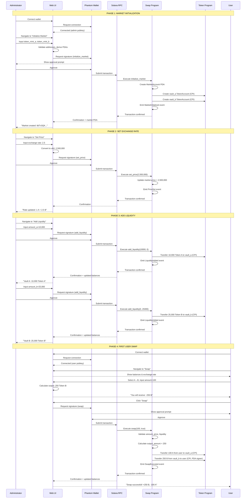

# WF-001: Market Setup and Operation

**ID:** WF-001
**Name:** Market Setup and Operation - End-to-End Flow
**Priority:** Must
**Status:** Active
**Version:** 1.0
**Last Updated:** 2026-03-22

## Overview

**Description:** This workflow describes the complete end-to-end process of setting up a new decentralized token swap market from initialization through the first successful user swap operation. It encompasses all critical administrator and user interactions required to establish a functional trading pair.

**Scope:**
- Market creation and infrastructure setup
- Price configuration
- Liquidity provisioning for both token vaults
- First user swap execution (both directions supported)

**Actors:**
- **Administrator (Primary)**: Creates market, sets exchange rate, provides initial liquidity
- **User (Secondary)**: Connects wallet and executes first swap transaction

**Trigger:** Administrator decides to create a new decentralized exchange market for two SPL tokens

**Preconditions:**
- Administrator has Phantom wallet with sufficient SOL balance (>= 0.01 SOL for rent + fees)
- Two valid SPL token mints exist on the target network (Token A and Token B)
- Administrator has balances of both Token A and Token B in associated token accounts (ATAs)
- User has Phantom wallet with balance of at least one of the tokens (A or B)
- Web UI or CLI tools are deployed and accessible

**Postconditions:**
- Market is fully operational with active exchange rate
- Both vaults have liquidity to support bidirectional swaps
- At least one user swap has been successfully executed
- All operations are auditable via emitted events

**Traceability:**
- **Requirements:** REQ-F-001, REQ-F-002, REQ-F-003, REQ-F-004, REQ-F-006, REQ-F-007, REQ-F-008, REQ-F-009, REQ-NF-009, REQ-NF-010, REQ-NF-011, REQ-NF-012
- **Use Cases:** UC-001, UC-002, UC-003, UC-004, UC-005
- **Entities:** ENT-MKT-001 (Market), ENT-VLT-001 (Vault), ENT-ADMIN-001 (Administrator), ENT-USER-001 (User)

---

## Workflow Steps

### Phase 1: Market Initialization

**Step 1.1: Administrator Connects Wallet**
- **Actor:** Administrator
- **Action:** Administrator opens web UI and clicks "Connect Wallet"
- **System:** UI prompts Phantom wallet connection
- **Output:** Wallet connected, administrator's public key displayed
- **Use Case:** UC-006 (implicit wallet connection)

**Step 1.2: Administrator Navigates to Market Initialization**
- **Actor:** Administrator
- **Action:** Navigates to "Initialize Market" page
- **System:** UI displays market initialization form with input fields for:
  - Token A mint address
  - Token B mint address
  - Estimated rent: ~0.005 SOL
- **Output:** Initialization form ready for input

**Step 1.3: Administrator Submits Token Mint Addresses**
- **Actor:** Administrator
- **Action:**
  - Inputs Token A mint address (e.g., `7xKXtg2CW87d97TXJSDpbD5jBkheTqA83TZRuJosgAsU`)
  - Inputs Token B mint address (e.g., `9yJEn5RT3YyFZqvJayV5e8xVF3W3vRwzfBZaXkjSZhKq`)
  - Reviews transaction details
  - Clicks "Initialize Market"
- **System:**
  - Validates mint addresses format (base58 encoding)
  - Derives market PDA: `[b"market", token_mint_a, token_mint_b]`
  - Derives vault_a PDA: `[b"vault_a", market]`
  - Derives vault_b PDA: `[b"vault_b", market]`
  - Builds initialize_market transaction
  - Displays Phantom approval prompt
- **Output:** Transaction ready for signing

**Step 1.4: Transaction Signing and Submission**
- **Actor:** Administrator
- **Action:** Reviews and approves transaction in Phantom wallet
- **System:**
  - Submits transaction to Solana RPC endpoint
  - Creates MarketAccount PDA with fields:
    - `authority`: Administrator's public key
    - `token_mint_a`: Token A mint address
    - `token_mint_b`: Token B mint address
    - `price`: 0 (not yet set)
    - `decimals_a`: Queried from Token A mint (e.g., 9)
    - `decimals_b`: Queried from Token B mint (e.g., 6)
    - `bump`: PDA bump seed
  - Creates vault_a TokenAccount (mint = Token A, authority = market PDA)
  - Creates vault_b TokenAccount (mint = Token B, authority = market PDA)
  - Emits MarketInitialized event
- **Output:**
  - Transaction confirmed
  - Market PDA address displayed: `8dTv3QKyJtLu9T4dhyRcW1zbk7X2GMqYa5hFDcj3pump`
  - Success message: "Market successfully created!"
- **Traceability:** UC-001, REQ-F-001, REQ-NF-009

**Validation Point 1:**
- **Check:** Query market account on-chain
- **Expected:** MarketAccount exists with correct authority and token mints
- **Failure Recovery:** If transaction fails (e.g., insufficient SOL), UI displays error and allows retry

---

### Phase 2: Exchange Rate Configuration

**Step 2.1: Administrator Navigates to Set Price**
- **Actor:** Administrator
- **Action:** From market dashboard, clicks "Set Exchange Rate"
- **System:** UI displays set price form showing:
  - Current price: 0 (not set)
  - Input field for new exchange rate
  - Explanation: "1 Token A = X Token B"
- **Output:** Price setting form ready

**Step 2.2: Administrator Sets Exchange Rate**
- **Actor:** Administrator
- **Action:**
  - Inputs exchange rate (e.g., 2.5 meaning 1 Token A = 2.5 Token B)
  - UI converts to u64 format: `2.5 × 10^6 = 2,500,000`
  - Reviews transaction
  - Clicks "Update Price"
- **System:**
  - Validates price > 0
  - Builds set_price transaction with `new_price = 2,500,000`
  - Verifies signer is market authority
  - Displays Phantom approval prompt
- **Output:** Transaction ready for signing

**Step 2.3: Price Update Transaction**
- **Actor:** Administrator
- **Action:** Approves transaction in Phantom
- **System:**
  - Submits transaction to RPC
  - Updates `market.price = 2,500,000`
  - Emits PriceSet event with old_price=0, new_price=2,500,000
- **Output:**
  - Transaction confirmed
  - UI displays: "Exchange rate updated to 1 Token A = 2.5 Token B"
- **Traceability:** UC-002, REQ-F-002, REQ-NF-010

**Validation Point 2:**
- **Check:** Query market account, verify `price = 2,500,000`
- **Expected:** Price field updated correctly
- **Failure Recovery:** If unauthorized, transaction fails with signer check error

---

### Phase 3: Liquidity Provisioning

**Step 3.1: Administrator Adds Liquidity to Vault A (Token A)**
- **Actor:** Administrator
- **Action:**
  - Navigates to "Add Liquidity" page
  - Sees current vault balances:
    - Vault A: 0 Token A
    - Vault B: 0 Token B
  - Inputs `amount_a = 10,000` (10,000 Token A to add)
  - Leaves `amount_b = 0` (not adding Token B yet)
  - Clicks "Add Liquidity"
- **System:**
  - Validates administrator has >= 10,000 Token A in ATA
  - Builds add_liquidity transaction (amount_a=10,000, amount_b=0)
  - Displays Phantom approval prompt
- **Output:** Transaction ready for signing

**Step 3.2: Vault A Liquidity Transaction**
- **Actor:** Administrator
- **Action:** Approves transaction
- **System:**
  - Performs CPI to Token Program: transfer 10,000 Token A from administrator's ATA to vault_a
  - Emits LiquidityAdded event (amount_a=10,000, amount_b=0)
- **Output:**
  - Transaction confirmed
  - UI updates: "Liquidity added successfully"
  - Vault A balance: 10,000 Token A
  - Administrator's Token A balance decreased by 10,000
- **Traceability:** UC-003, REQ-F-003, REQ-NF-011

**Step 3.3: Administrator Adds Liquidity to Vault B (Token B)**
- **Actor:** Administrator
- **Action:**
  - Remains on "Add Liquidity" page
  - Inputs `amount_a = 0` (not adding Token A)
  - Inputs `amount_b = 25,000` (25,000 Token B to add)
  - Clicks "Add Liquidity"
- **System:**
  - Validates administrator has >= 25,000 Token B in ATA
  - Builds add_liquidity transaction (amount_a=0, amount_b=25,000)
  - Displays Phantom approval prompt
- **Output:** Transaction ready for signing

**Step 3.4: Vault B Liquidity Transaction**
- **Actor:** Administrator
- **Action:** Approves transaction
- **System:**
  - Performs CPI to Token Program: transfer 25,000 Token B from administrator's ATA to vault_b
  - Emits LiquidityAdded event (amount_a=0, amount_b=25,000)
- **Output:**
  - Transaction confirmed
  - UI displays updated balances:
    - Vault A: 10,000 Token A
    - Vault B: 25,000 Token B
- **Traceability:** UC-003, REQ-F-004, REQ-NF-011

**Alternative: Add Both Liquidity Amounts in Single Transaction (REQ-F-005)**
- Administrator can input both `amount_a > 0` AND `amount_b > 0` in step 3.3
- Single transaction transfers both tokens atomically
- If either transfer fails, both are rolled back

**Validation Point 3:**
- **Check:** Query vault_a and vault_b token accounts
- **Expected:**
  - vault_a.amount = 10,000 Token A
  - vault_b.amount = 25,000 Token B
- **Failure Recovery:** If insufficient balance, transaction fails before CPI

---

### Phase 4: First User Swap (Token A to Token B)

**Step 4.1: User Connects Wallet**
- **Actor:** User
- **Action:** Opens web UI and clicks "Connect Wallet"
- **System:** Phantom wallet connects
- **Output:** User's public key displayed, token balances shown:
  - Token A: 1,000
  - Token B: 500

**Step 4.2: User Navigates to Swap Interface**
- **Actor:** User
- **Action:** Clicks "Swap" menu item
- **System:** UI displays swap interface with:
  - Swap direction selector (A → B or B → A)
  - Input amount field
  - Calculated output preview
  - Current exchange rate: "1 Token A = 2.5 Token B"
  - Vault liquidity:
    - Vault A: 10,000 Token A
    - Vault B: 25,000 Token B
- **Output:** Swap form ready

**Step 4.3: User Selects Swap Direction and Amount**
- **Actor:** User
- **Action:**
  - Selects direction: "Token A → Token B"
  - Inputs `amount = 100` (100 Token A to swap)
- **System:**
  - Calculates output using formula:
    ```
    amount_b = (100 × 2,500,000 × 10^6) / (10^6 × 10^9)
             = 250,000,000,000 / 1,000,000,000
             = 250 Token B
    ```
  - Displays: "You will receive approximately 250 Token B"
  - Validates:
    - User has >= 100 Token A (satisfied: 1,000 >= 100)
    - Vault B has >= 250 Token B (satisfied: 25,000 >= 250)
- **Output:** Swap preview displayed

**Step 4.4: User Submits Swap Transaction**
- **Actor:** User
- **Action:** Clicks "Swap" button
- **System:**
  - Builds swap transaction (amount=100, swap_a_to_b=true)
  - Displays Phantom approval prompt showing:
    - You will send: 100 Token A
    - You will receive: ~250 Token B
    - Transaction fee: ~0.000005 SOL
- **Output:** Transaction ready for signing

**Step 4.5: Swap Execution**
- **Actor:** User
- **Action:** Approves transaction in Phantom
- **System:**
  - Submits transaction to RPC
  - Validates on-chain:
    - amount > 0 (satisfied)
    - price > 0 (satisfied: 2,500,000 > 0)
    - vault_b.amount >= 250 (satisfied)
  - Calculates output amount using checked arithmetic
  - Performs CPI 1: Transfer 100 Token A from user's ATA to vault_a (user signs)
  - Performs CPI 2: Transfer 250 Token B from vault_b to user's ATA (market PDA signs with bump)
  - Emits SwapExecuted event:
    ```
    market: 8dTv3QK...
    user: <user_pubkey>
    swap_a_to_b: true
    input_amount: 100
    output_amount: 250
    timestamp: 1711084800
    ```
- **Output:**
  - Transaction confirmed
  - UI displays: "Swap successful! You exchanged 100 Token A for 250 Token B"
  - Updated balances:
    - User Token A: 900 (-100)
    - User Token B: 750 (+250)
    - Vault A: 10,100 (+100)
    - Vault B: 24,750 (-250)
- **Traceability:** UC-004, REQ-F-006, REQ-NF-012

**Validation Point 4:**
- **Check:** Query all token accounts
- **Expected:** Balances updated atomically as described above
- **Failure Recovery:** If any step fails, entire transaction reverts (no partial transfers)

---

### Alternative Flow: First User Swap (Token B to Token A)

**Step 4A.3: User Selects Reverse Direction**
- **Actor:** User
- **Action:**
  - Selects direction: "Token B → Token A"
  - Inputs `amount = 500` (500 Token B to swap)
- **System:**
  - Calculates output using inverse formula:
    ```
    amount_a = (500 × 10^6 × 10^9) / (2,500,000 × 10^6)
             = 500,000,000,000,000 / 2,500,000,000,000
             = 200 Token A
    ```
  - Displays: "You will receive approximately 200 Token A"
  - Validates:
    - User has >= 500 Token B (satisfied)
    - Vault A has >= 200 Token A (satisfied: 10,100 >= 200)
- **Output:** Swap preview displayed

**Step 4A.5: Reverse Swap Execution**
- **Actor:** User
- **Action:** Approves transaction
- **System:**
  - Validates price > 0 (critical for B→A to avoid division by zero)
  - Performs CPI 1: Transfer 500 Token B from user's ATA to vault_b
  - Performs CPI 2: Transfer 200 Token A from vault_a to user's ATA
  - Emits SwapExecuted event (swap_a_to_b=false, input=500, output=200)
- **Output:**
  - Transaction confirmed
  - Updated balances:
    - User Token A: 1,100 (+200)
    - User Token B: 250 (-500)
    - Vault A: 9,900 (-200)
    - Vault B: 25,250 (+500)
- **Traceability:** UC-005, REQ-F-007

---

## Workflow Sequence Diagram



---

## Exception Handling

### EF1: Market Initialization Fails - Insufficient SOL
- **Trigger:** Administrator has < 0.005 SOL
- **Response:**
  - Transaction simulation fails before submission
  - UI displays: "Insufficient SOL balance. You need at least 0.005 SOL. Current: 0.002 SOL."
- **Recovery:** Administrator funds wallet and retries

### EF2: Market Already Exists
- **Trigger:** Administrator attempts to initialize same token pair twice
- **Response:**
  - Anchor's `init` constraint fails (account already exists)
  - UI displays: "Market already exists for this token pair. Market address: 8dTv3QK..."
- **Recovery:** UI provides link to existing market dashboard

### EF3: Price Not Set Before Swap
- **Trigger:** User attempts swap before administrator sets price (price = 0)
- **Response:**
  - Swap instruction fails with `PriceNotSet` error
  - UI displays: "Swaps unavailable: Exchange rate not configured. Contact administrator."
- **Recovery:** Administrator must complete Phase 2 before swaps can execute

### EF4: Insufficient Liquidity in Vault
- **Trigger:** User requests swap output exceeding vault balance
- **Response:**
  - Swap instruction fails with `InsufficientLiquidity` error before CPI
  - UI displays: "Insufficient liquidity. Requested 5,000 B, but only 2,000 available. Try smaller amount."
- **Recovery:** User reduces swap amount or administrator adds more liquidity

### EF5: Unauthorized Price/Liquidity Change
- **Trigger:** Non-administrator attempts to call set_price or add_liquidity
- **Response:**
  - Anchor signer check fails
  - Transaction fails with "A has_one constraint was violated"
- **Recovery:** Only market authority can perform these operations

### EF6: Arithmetic Overflow in Swap Calculation
- **Trigger:** User inputs very large swap amount causing overflow
- **Response:**
  - Checked arithmetic returns None
  - Transaction fails with `ArithmeticOverflow` error
- **Recovery:** User must input smaller amount within u64 bounds

### EF7: User Insufficient Balance
- **Trigger:** User attempts swap with insufficient input token balance
- **Response:**
  - Token Program CPI fails with `InsufficientFunds` error
  - Transaction reverts atomically
- **Recovery:** User reduces swap amount or acquires more tokens

---

## Business Rules

- **BR-WF-001**: Market must be initialized before any other operations (REQ-F-001)
- **BR-WF-002**: Price must be set (> 0) before swaps can execute (REQ-NF-002)
- **BR-WF-003**: Liquidity can be added at any time by administrator (REQ-F-003, REQ-F-004)
- **BR-WF-004**: Both vaults should have liquidity to support bidirectional swaps
- **BR-WF-005**: Only administrator (market authority) can set price and add liquidity (REQ-F-008)
- **BR-WF-006**: Any user can execute swaps once market is operational (REQ-F-009)
- **BR-WF-007**: All operations are atomic - succeed completely or fail completely (REQ-NF-016)
- **BR-WF-008**: All state changes emit events for auditability (REQ-NF-009 through REQ-NF-012)

---

## Success Criteria

- **SC1**: Market successfully initialized with unique PDA address
- **SC2**: Exchange rate configured and stored in market.price field
- **SC3**: Vault A has liquidity (balance > 0)
- **SC4**: Vault B has liquidity (balance > 0)
- **SC5**: At least one user swap completes successfully in either direction
- **SC6**: All token balances updated correctly (user and vaults)
- **SC7**: All events emitted (MarketInitialized, PriceSet, LiquidityAdded × 2, SwapExecuted)
- **SC8**: No partial state updates (atomicity preserved)

---

## Performance Characteristics

| Metric | Target | Actual (Typical) | Notes |
|--------|--------|------------------|-------|
| Market Initialization Time | < 2 seconds | ~800ms | Single transaction, 1 block confirmation |
| Price Update Time | < 2 seconds | ~600ms | Lightweight state update |
| Liquidity Addition Time | < 2 seconds | ~700ms | CPI to Token Program |
| Swap Execution Time | < 2 seconds | ~800ms | Two CPI calls + calculation |
| Total Workflow Time (Phase 1-4) | < 10 seconds | ~5-8 seconds | Depends on user interaction speed |

---

## Audit Trail

All operations in this workflow are traceable via events:

1. **MarketInitialized** event (Phase 1, Step 1.4)
   - Market PDA address
   - Token mint addresses
   - Administrator's public key
   - Timestamp

2. **PriceSet** event (Phase 2, Step 2.3)
   - Market PDA
   - Old price (0)
   - New price (2,500,000)
   - Timestamp

3. **LiquidityAdded** events (Phase 3, Steps 3.2 and 3.4)
   - Market PDA
   - Amount A added
   - Amount B added
   - Timestamp

4. **SwapExecuted** event (Phase 4, Step 4.5)
   - Market PDA
   - User's public key
   - Swap direction
   - Input amount
   - Output amount
   - Timestamp

All events are indexed by Solana RPC nodes and can be queried via `getProgramAccounts` or WebSocket subscriptions.

---

## Extensions and Variations

### Extension 1: Market Setup with Dual Liquidity Addition
- Administrator adds both Token A and Token B liquidity in a single transaction (REQ-F-005)
- Phase 3 becomes a single step instead of two separate transactions
- Reduces transaction fees and confirmation time

### Extension 2: Swap with Slippage Protection (Future Enhancement)
- User specifies maximum acceptable slippage (e.g., 1%)
- On-chain validation ensures output_amount >= min_output_amount
- Protects user from front-running or rapid price changes (REQ-NF-007)

### Extension 3: Batch Liquidity Provision Over Time
- Administrator adds liquidity incrementally as market demand grows
- Multiple add_liquidity invocations throughout market lifecycle
- Supports gradual liquidity scaling

### Extension 4: Multi-User Concurrent Swaps
- Multiple users execute swaps simultaneously after Phase 4
- Vault balances updated atomically per transaction
- Market supports unlimited concurrent swap operations (Solana parallelization)

---

## Validation Checklist

**Pre-Workflow Validation:**
- [ ] Administrator wallet has >= 0.01 SOL
- [ ] Token A mint exists on target network
- [ ] Token B mint exists on target network
- [ ] Administrator has Token A balance >= planned liquidity amount
- [ ] Administrator has Token B balance >= planned liquidity amount

**Post-Phase 1 Validation:**
- [ ] Market PDA account exists on-chain
- [ ] Market.authority = administrator's pubkey
- [ ] Market.token_mint_a matches input
- [ ] Market.token_mint_b matches input
- [ ] Market.price = 0 (not yet set)
- [ ] Vault_a exists with mint = token_mint_a
- [ ] Vault_b exists with mint = token_mint_b
- [ ] MarketInitialized event emitted

**Post-Phase 2 Validation:**
- [ ] Market.price > 0
- [ ] PriceSet event emitted with correct values

**Post-Phase 3 Validation:**
- [ ] Vault_a.amount > 0
- [ ] Vault_b.amount > 0
- [ ] Two LiquidityAdded events emitted

**Post-Phase 4 Validation:**
- [ ] User's input token balance decreased by input_amount
- [ ] User's output token balance increased by output_amount
- [ ] Vault input balance increased by input_amount
- [ ] Vault output balance decreased by output_amount
- [ ] SwapExecuted event emitted
- [ ] All balance changes sum to zero (conservation of tokens)

---

## References

**Use Cases:**
- UC-001: Initialize Market
- UC-002: Set Exchange Rate
- UC-003: Add Liquidity
- UC-004: Swap Token A to B
- UC-005: Swap Token B to A
- UC-006: Connect Wallet (implicit)

**Requirements:**
- REQ-F-001: Initialize Market
- REQ-F-002: Set Exchange Rate
- REQ-F-003: Add Liquidity to Vault A
- REQ-F-004: Add Liquidity to Vault B
- REQ-F-005: Add Liquidity to Both Vaults
- REQ-F-006: Swap Token A to Token B
- REQ-F-007: Swap Token B to Token A
- REQ-F-008: Authority-Only Market Modification
- REQ-F-009: Public Swap Access
- REQ-NF-009: Event Emission for Market Initialization
- REQ-NF-010: Event Emission for Price Updates
- REQ-NF-011: Event Emission for Liquidity Additions
- REQ-NF-012: Event Emission for Swaps
- REQ-NF-016: Transaction Atomicity

**Domain Entities:**
- ENT-MKT-001: Market
- ENT-VLT-001: Vault
- ENT-ADMIN-001: Administrator
- ENT-USER-001: User
- ENT-SWP-001: Swap Transaction

---

**Changelog:**

| Version | Date       | Changes                                     |
|---------|------------|---------------------------------------------|
| 1.0     | 2026-03-22 | Initial workflow specification              |
